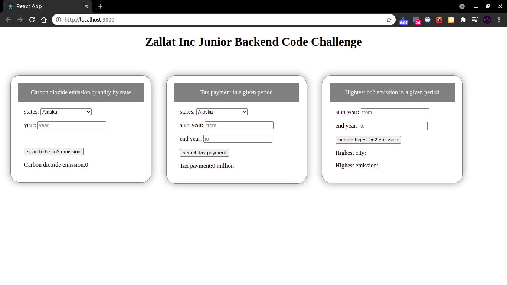

# Zallat-backend-Feike-Li

**note:**

- I added a simple UI using react hooks to make it more convenient for you to test.
- All source code of backend are saved in the _server_ folder

## How to run

1. git clone && cd Zalla-backend-Feike-Li
2. npm install && npm start
3. react hooks + mongodb atlas + node express

## Links

1. Carbon dioxide emission quantity from some state from some year
   > http://localhost:8080/api/getseriesByState?year=2000&state=California
2. Total tax that the state government paid in that period.
   > http://localhost:8080/api/getPaynum?from=2003&to=2006&state=California
3. (**Bonus**) State that has the highest CO2 emission in a given period

- cloud data platform: mongo atlas
- 5 datasets: Alabama/Alaska/Arizona/Arkansas/California
- endpoint: http://localhost:8080/api/getHighMsgByMongo?from=2003&to=2006

## Others

1. mongo uri has exposed on github, usually we mask it by environment variable
2. input validation should be done by front-end, I used try catch in backend to prevent invalid result returned since this is a backend test

## Screenshot

